# Leonardo Modifier Keys Controller

  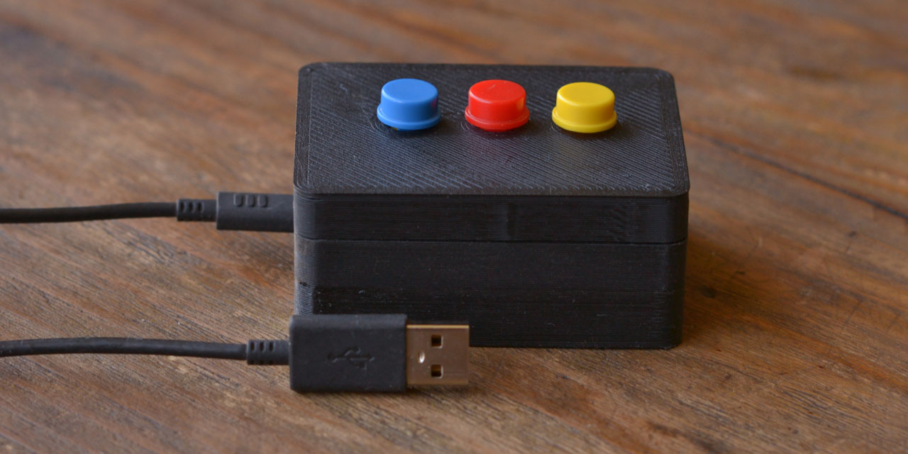

An Arduino Leonardo powered box that allows you to press the modifier keys of the computer.

## Description

An USB device that allows you to press the main modifier keys of the keyboard in case you can't put both hands in the keyboard. It's a box with three buttons corresponding to Control, Shift and Alt and a micro USB port.

## Hardware

1x Arduino Leonardo

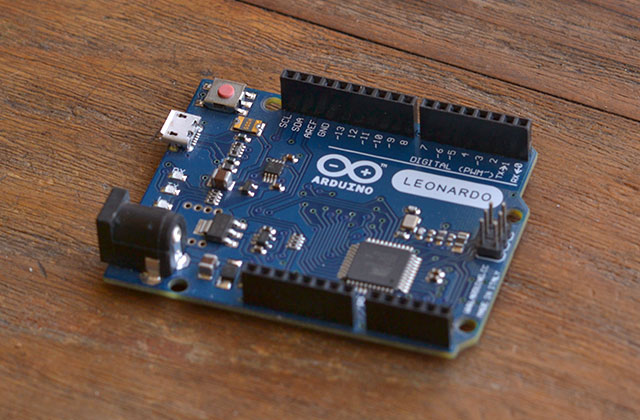

1x Protoshield

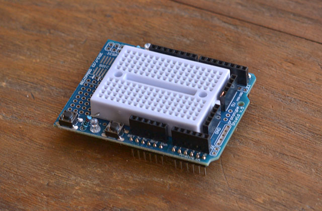

3x Push Buttons

3x resistors (300-10k Ω)

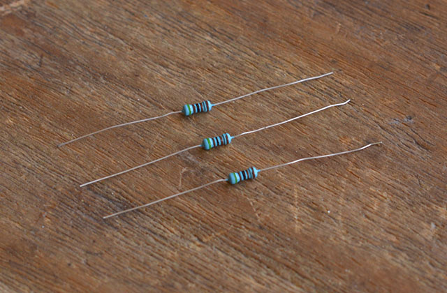

3D Printed case (STL included)

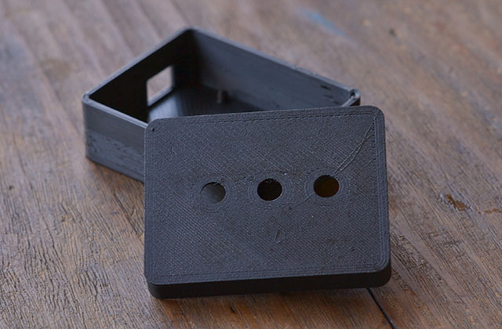

## Schematics

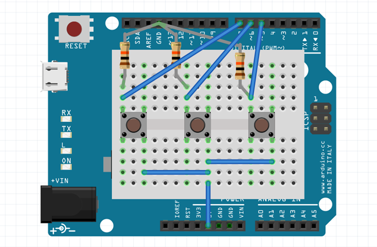

## Code

The Arduino code is included

## Assembly

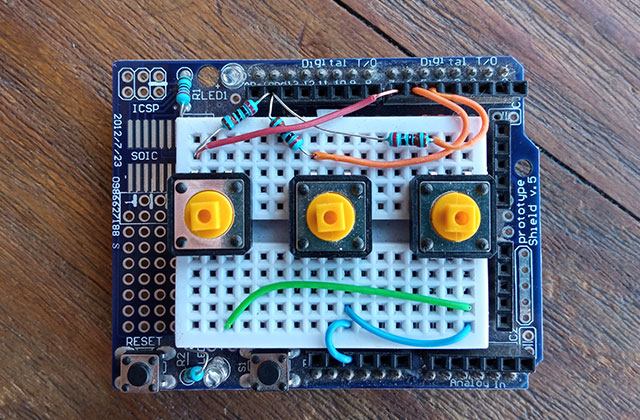

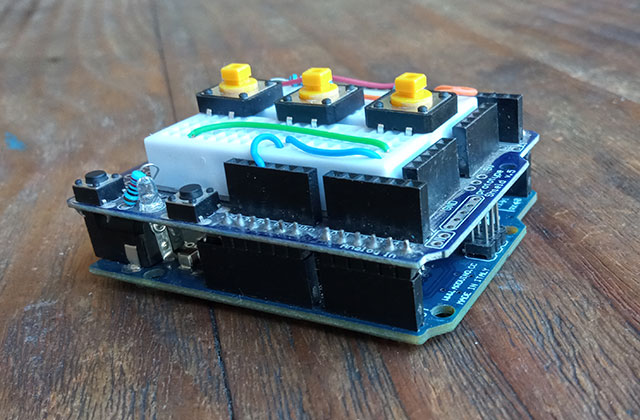

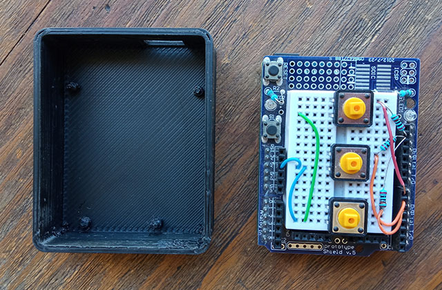

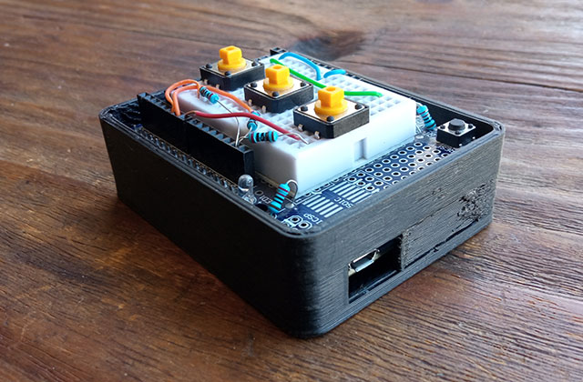

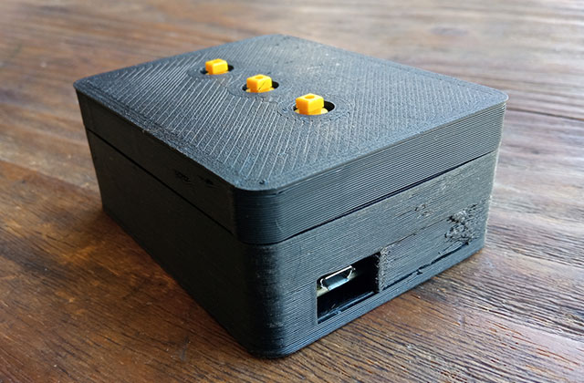

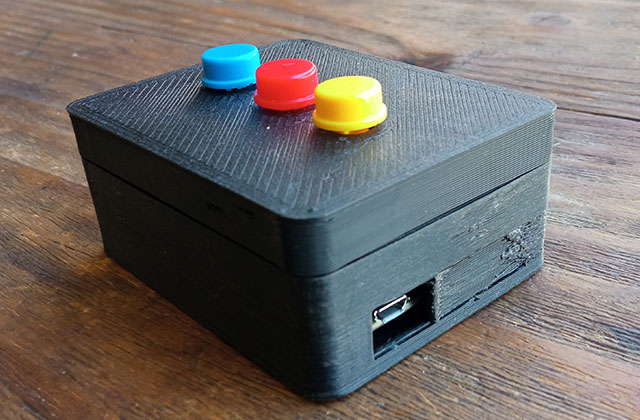

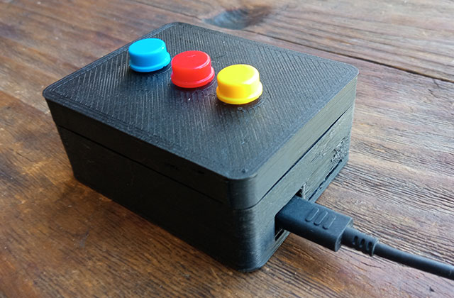

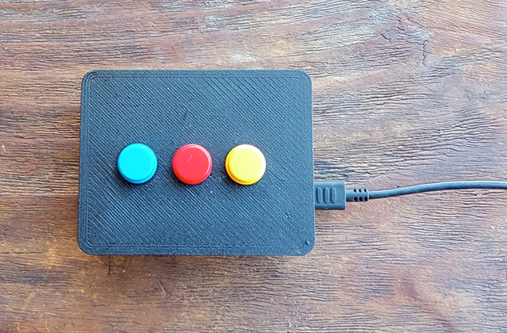

